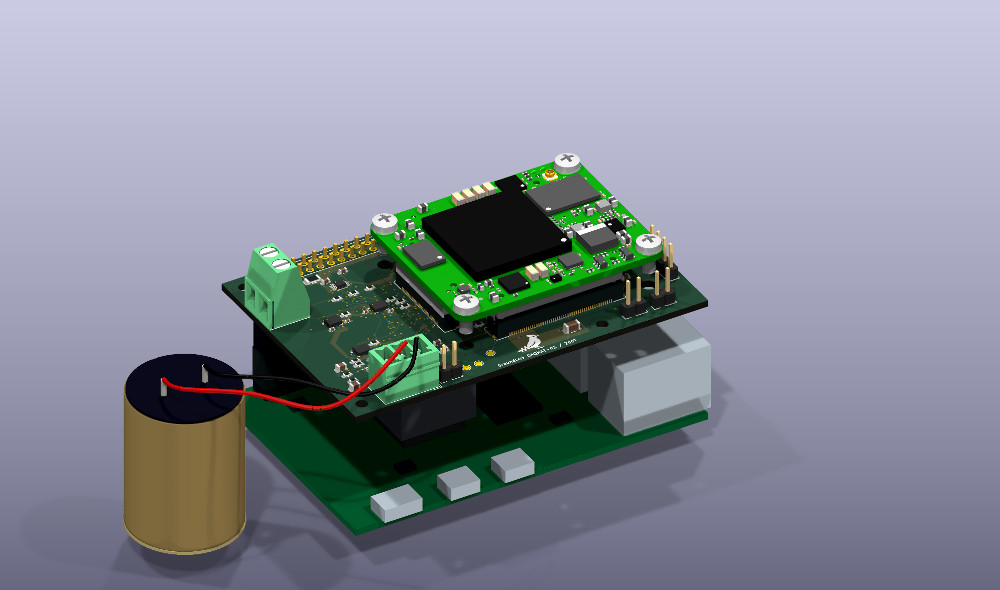
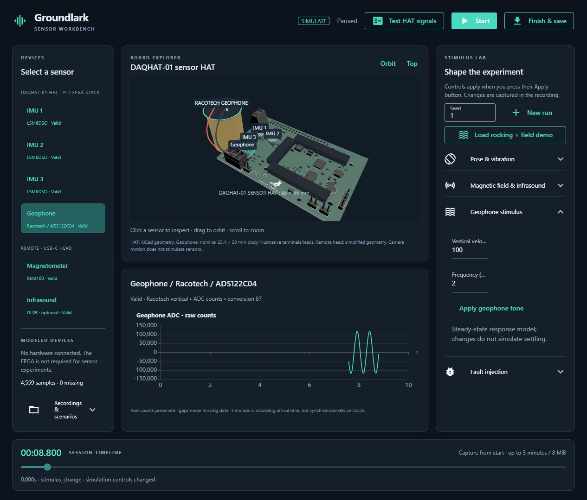

# Groundlark — an open source seismic acquisition platform with support for FPGAs and BISCUT AI chips

Groundlark is an open hardware seismic acquisition platform combining a
Raspberry Pi, a three-IMU DAQHAT-01 sensor HAT, a Trenz Artix-7 200T FPGA module,
and a passive geophone.

Current HAT CAD and vendor Trenz model; Pi, baseline socket and Racotech geophone
are conceptual geometry. Lead dressing is illustrative; stack fit remains under
review. [Render sources and reproduction](docs/readme-render.md).

Formerly ShakeSense / SenseShake. See the [naming migration](docs/groundlark-rename.md)
for updated commands and compatibility with existing recordings.

**Current focus:** sensor development on the Pi → DAQHAT-01 HAT → Trenz FPGA stack.
Coldfoot ASIC/runtime integration is deferred. Preserve the required FPGA
connections while building sensor acquisition and tests; see the
[four-step sensor plan](docs/sensor-development-plan.md).

**DAQHAT-01 sensors:** three XYZ LSM6DSO IMUs and one ADS122C04 geophone input.
The dedicated inclinometer is removed; sensor IDs 4/5 are reserved for older recordings.
See [the circuit revision](docs/inclinometer-removal.md).

**DAQHAT-01 hardware:** [internal FPGA link](docs/fpga-host-link.md)
reserves six QSPI wires, keeps UART, adds switched Pi-driven JTAG, and removes
the external GPIO ribbons/connectors and cable guide. Pi 4 initially uses SPI6;
native quad transfers need a separate host solution. The circuit, routed PCB and renders use this internal connection.

**IMU layout:** [bypass-loop improvements](docs/imu-placement-review.md) shorten local
supply and ground paths while retaining sensor separation from the FPGA/regulator.
These geometry checks do not replace measurements on the assembled HAT.

**Latest validation:** the [DAQHAT-01 hardening review](docs/daqhat-01-link-hardening.md)
records the expanded tests, fixes, prototype fabrication preparation steps and
physical qualification still required on first articles.

**Assembly preparation:** the [JLCPCB review package](docs/jlcpcb-assembly.md)
targets one assembled DAQHAT-01 HAT with exact part identifiers and 38 catalog
identities across 38 BOM lines. J1 now specifies Megastar ZX-PM2.54-2-20PY /
JLCPCB C7499354; its shorter socket needs stack-height and bottom-side placement
review. Quantity minimum, assembly framing, sourcing and
placement review remain open; the package is not released for manufacture.
The [latest BOM correction](docs/assembly-shortages.md) selects stocked alternatives
for eight parts and corrects F80's fuse package mismatch without changing Gerbers.
The [full BOM placement audit](docs/assembly-placement.md) checks all 117 placements,
with catalog mappings for all 117. C91/C92 now select KEMET C140950, retaining
1 nF / 50 V / C0G / ±5% / 0603. The audit includes the connector and IC rotation
corrections; use its replacement CPL and BOM together.

**Portable tests:** run `./lab.ps1 build` once, then `./lab.ps1 test` from
PowerShell. See the [portable lab guide](docs/portable-lab.md) for profiles,
bounded scratch storage, automatic five-run retention, and cleanup previews.
The [initial sensor contract](docs/sensor-contract.md) is implemented; run
`./lab.ps1 test -Profile software` for schemas, compatibility, acquisition,
recording/replay and recovery tests. It saves a six-sensor demo recording.
See [running the sensor software](docs/sensor-software.md). Rebuild the image
once if it predates the pinned Buf tool.

**Virtual sensors:** drive motion, tilt, magnetic fields, pressure and geophone signals with
[saved stimulus scenarios](docs/stimulus-models.md), including timed faults.

**Sensor workbench:** run `./ui.ps1` (Windows) or `./ui.sh` (Linux/macOS), then
open `http://127.0.0.1:8080`. The dark-mode, Python-authored UI offers a selectable
3D HAT, six virtual sensors, raw-data charts, stimulus/fault controls and
recording/replay. Requires `uv`; dependencies install into the project's ignored
`.local/` folder. See the [workbench guide](docs/sensor-workbench.md).
Press **Test HAT signals** for a measured eight-second capture through the actual
Pi drivers on modeled buses, with signal tolerances, replay and downloadable results.

Actual browser screenshot with simulated data; selecting the geophone can or its
HAT input highlights both and displays the same ADC stream.

| Directory | Contents |
| --- | --- |
| [hw/](hw/README.md) | Atopile circuits, KiCad boards, models, hardware checks and SPICE. |
| [sw/](sw/README.md) | Pi acquisition/simulation, contracts and tests; remote firmware and FPGA bring-up scopes. |
| [docs/](docs/README.md) | Design, interface contracts, validation and build instructions. |
| [environment/](docs/portable-lab.md) | Pinned Docker test environment and cleanup tooling. |

See the [project map](docs/project-layout.md) for ownership and generated-file rules.

**Non-FPGA boards:** [A2 sensor HAT](hw/boards/groundlark-hat/3d.png) and
[remote USB-C sensor head](hw/boards/groundlark-field-head/3d.png).

The infrasound sensor is optional and is not fitted in the default render.
[View the infrasound option fitted](hw/boards/groundlark-field-head/3d-infrasound-option.png).

**DAQHAT-01 FPGA variant:** [Pi-size 85 × 56 mm Trenz 200T carrier](docs/trenz-hat.md),
with [carrier 3D](hw/boards/groundlark-daqhat-01/3d.png) and
[three-board stack concept](hw/boards/groundlark-daqhat-01/pi-trenz-stack-concept.png).
It is an alternative to the historical ASIC HAT and requires external regulated 3.3 V
FPGA power. Six internal data wires plus UART/reset connect the Pi to the
module, with Pi-driven JTAG sharing the data-link pins. No external FPGA cables
are needed; see the [pin contract](docs/trenz-gpio-breakout.csv).
Physical qualification remains pending.
The active DAQHAT-01 has a [single Racotech geophone input](docs/geophone-input.md) and no GNSS.

The [pre-fab review](docs/pre-fab-review.md) adds analog tolerance/transient checks
and acquisition stress tests, fixes two loss-handling defects, and identifies
the remaining physical qualification work. The geophone filter/protection layout
meets its path-length targets. Four straight Pi supports replace the previous
ribbon guide and offset spacer; see the [assembly notes](docs/stack-assembly.md).

The internal-link HAT uses a conventional six-layer FR-4 stack with through-vias only;
see the [fabrication cost audit](docs/cost-reduction.md). The geophone input,
power envelope, GPIO riser and buffered acquisition are tracked in
[engineering closure](docs/daqhat-01-engineering-closure.md); physical qualification
remains open. Fabrication approval belongs to the project owner. Ethernet is not exposed.

[Legacy GNSS timing capture/correlation](docs/utc-timing.md) and an
[executable physical bench checklist](docs/bench-procedure.md) are available.
UTC estimates require explicit timing bounds; physical measurements remain pending.

The historical **A2** is an engineering prototype with four LSM6DSO IMUs, an SCL3300 inclinometer,
MAX-M10S GNSS, a remote RM3100 XYZ magnetometer and optional DLVR differential
pressure. No geophone. The Pi acquires/preprocesses samples and submits compatible
workloads to Coldfoot through its host UART.

**A2 uses the run-1 1×1 module.** The carrier includes its supply, decoupling,
two independent 25 MHz clocks, supervised reset, digital-pad biasing and UART
power isolation. Coldfoot silicon source was not changed. This is a prototype,
**not a fabrication-qualified product**; see [validation](docs/validation.md).

The HAT is 120 × 56 mm, retaining the Pi header and four mounting-hole positions.
It extends beyond the usual Pi outline. The remote head is 70 × 45 mm.

**USB-C is only on the remote sensor head**, which plugs directly into a Pi USB
port for data and power. The HAT has no USB connector or remote cable header.
See the [USB interface and firmware contract](docs/usb-sensor-head.md).
USB firmware still needs implementation before the head can enumerate.

- [Atopile project](hw/ato.yaml), [HAT circuit](hw/elec/hat.ato), [field circuit](hw/elec/field_head.ato), [parts](hw/elec/parts.ato).
- [KiCad HAT PCB](hw/boards/groundlark-hat/groundlark-hat.kicad_pcb) and [review schematic](hw/boards/groundlark-hat/groundlark-hat.kicad_sch).
- [KiCad field PCB](hw/boards/groundlark-field-head/groundlark-field-head.kicad_pcb).
- [HAT 3D](hw/boards/groundlark-hat/3d.png), [field-head 3D](hw/boards/groundlark-field-head/3d.png), [infrasound option fitted](hw/boards/groundlark-field-head/3d-infrasound-option.png).
- [HAT BOM](hw/boards/groundlark-hat/bom.csv), [field BOM](hw/boards/groundlark-field-head/bom.csv).
- [Design](docs/design-a0.md), [Coldfoot mapping](docs/coldfoot-integration.md), [sources](docs/sources.md), [upstream sensors](docs/sensor-inventory.md).
- [Simulation scope](hw/simulation/README.md), [rebuilding](docs/build.md).
- [Artix-7 200T module shortlist and FPGA carrier requirements](docs/fpga-options.md).

Electrical changes belong in `.ato` files. `hw/layout.json` contains placement and
presentation metadata, not connections. PCB assembly reads native footprints and
nets from atopile. Review schematics are derived and checked against the board.
MPNs are explicitly selected; the automatic supplier picker is not used.

3D images are rendered by KiCad from the actual board. Standard packages use
KiCad models. Custom modules, the Pi socket and a few missing stock bodies use
simplified dimensioned envelopes, not supplier-certified STEP assemblies. The
pressure sensor is DNP in the default assembly.
