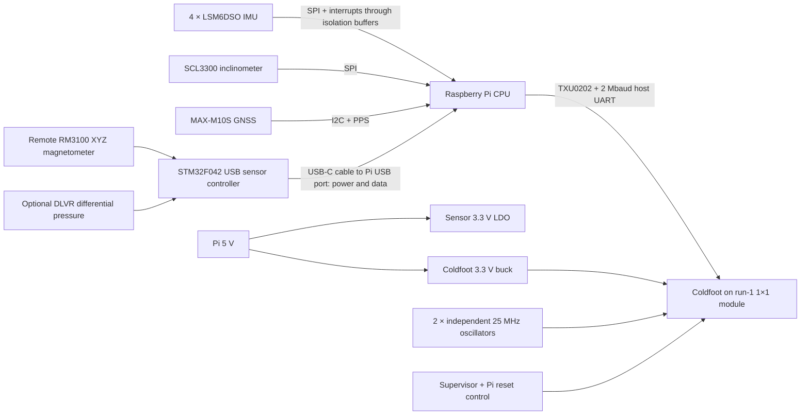

# ShakeSense A2 design

**Atopile engineering prototype, 2026-09-23.** This document replaces the earlier
A0 description in place. Electrical source is in `elec/`; native KiCad boards,
derived review schematics, explicit BOMs and reports are in `hardware/`.

The Raspberry Pi acquires, timestamps, calibrates and records samples, then
encodes suitable features/events for the existing Coldfoot host runtime. Direct
sensor acquisition by Coldfoot would require new chip functionality and is not
part of this design. No silicon source was modified.

## Sensors

| Function | Selected part | Interface and limitations |
|---|---|---|
| Motion array | 4 × LSM6DSOTR | XYZ acceleration + XYZ angular rate; shared SPI, separate CS/INT1. Inspired by GeoShake. Averaging benefit depends on measured correlation and timing. |
| Precision leveling | SCL3300-D01-10 | SPI, three-axis inclination/acceleration, CRC and off-frame responses. Inspired by AnyShake; leveling assumes stationary installation. |
| Position/time | MAX-M10S-00B | I2C 0x42 and PPS; passive external GNSS antenna on U.FL. Geographic position/time, not stationary heading. |
| Magnetics | Complete PNI 14190 RM3100 XYZ module | Remote I2C 0x20. Measures magnetic variations associated with geomagnetic/auroral activity, not optical aurora. Preserve signed 24-bit data and calibrate installation offsets. |
| Optional infrasound | DLVR-F50D-E1BS-I-NI3F, DNP | Remote I2C 0x28; proposed ±0.5 inH2O (~125 Pa), 3.3 V option. Ordering suffix requires supplier confirmation. Reference volume, controlled leak and wind filtering determine low-frequency performance. |

No geophone or geophone analog front end is present. The magnetometer and
pressure additions are new integrations, not claims of upstream driver support.
[The inventory](sensor-inventory.md) distinguishes actual AnyShake/GeoShake support.

## Power and support components

TLV1117LV33DCYR derives a separate sensor 3.3 V rail from Pi 5 V. It has 10 uF +
100 nF input and 22 uF + 100 nF output capacitance. Local bypass capacitors are
fitted at the IMUs, inclinometer, GNSS and interface ICs.
The SCL3300 A_EXTC/D_EXTC pins each have their own 100 nF capacitor. GNSS V_BCKP
is left open because no backup source is provided.

SN74LVC8T245 forward/return buffers isolate the Pi SPI/PPS/interrupt domains.
GPIO26 controls active-low output enable, pulled high at boot. Chip selects have
10 kohm pull-ups; unused buffer inputs have defined levels. ISO1640 bridges the
I2C power domains; **grounds are joined**, so the assembly is not galvanically
isolated. Its side-1 low output can reach 0.71 V; verify the selected Pi's input
threshold (design requirement VIL ≥0.8 V). Pi-side I2C uses the Pi's pull-ups;
sensor-side and remote buses have 4.7 kohm pull-ups. Begin at 100 kHz.

The remote head is independently powered from the Pi USB port: a 500 mA-hold
PTC feeds an AP2112K-3.3 LDO with 2.2 uF input and 4.7 uF output capacitance.
An STM32F042K6 reads the sensors over local I2C. TPS22919 switches sensor power
off before enumeration and during USB suspend. Separate 5.1 kohm CC resistors
support either USB-C cable orientation; USBLC6 arrays protect data and CC lines.
See [USB circuit and firmware contract](usb-sensor-head.md). Coldfoot retains
its separate supply, clocks and reset; see [integration](coldfoot-integration.md).

## Pi allocation

| Function | BCM GPIO | Physical header pins |
|---|---|---|
| I2C SDA/SCL | 2 / 3 | 3 / 5 |
| GNSS PPS | 4 | 7 |
| SPI MOSI/MISO/SCLK | 10 / 9 / 11 | 19 / 21 / 23 |
| IMU1/2/3/4 CS | 8 / 7 / 5 / 6 | 24 / 26 / 29 / 31 |
| IMU1/2/3/4 INT1 | 27 / 22 / 23 / 24 | 13 / 15 / 16 / 18 |
| Inclinometer CS | 13 | 33 |
| Sensor buffers enable, active low | 26 | 37 |
| Coldfoot UART TX/RX | 14 / 15 | 8 / 10 |
| Coldfoot reset assertion, active high | 17 | 11 |
| Coldfoot UART enable, active high | 25 | 22 |
| HAT ID SDA/SCL | ID_SD / ID_SC | 27 / 28 |

The 24LC32A ID EEPROM has 3.9 kohm bus pull-ups, local bypass, a 1 kohm write
protect pull-up and a programming shunt. No EEPROM image, overlay, driver or
inference model is delivered. Configure each sensor's SPI mode/rate, disable
the serial console for Coldfoot, and measure PPS and sample timestamp latency.

## Cable and mechanics

Use a USB data cable from the remote head to an existing Pi USB host port.
There is no cable connection to the HAT. Select USB-A-to-C or C-to-C according
to the Pi's host port. Begin with a 1–3 m certified cable and measure magnetic
noise at the installation distance. USB-C describes the connector; the device
uses USB 2.0 full-speed, not USB Power Delivery.

The HAT is 120 × 56 mm. Pi mounting holes remain at (3.5,3.5), (61.5,3.5),
(3.5,52.5), (61.5,52.5) mm. It extends beyond the normal outline; support the
overhang and verify cooler, ports, ribbon cables and enclosure clearance.
The field head is 70 × 45 mm. Use nonferrous mounting hardware near RM3100.
The Pi socket mounts underneath; the run-1 module mounts above on a 3 mm stack.

The HAT uses six copper layers, with In1 and In4 reserved for GND. The field head
uses four, with both inner layers reserved for GND. Exact fabrication stackup,
RF impedance and thermal copper review remain release tasks. The GNSS RF route
is held on the front layer; its provisional width is not a 50-ohm signoff.

Mount the field head away from the Pi, fan, accelerator and power converter.
Its orientation must be calibrated separately: the HAT inclinometer cannot
automatically level-correct a remotely mounted magnetometer. Validate pressure
pneumatics, magnetic noise and motion noise before claiming detection sensitivity.
