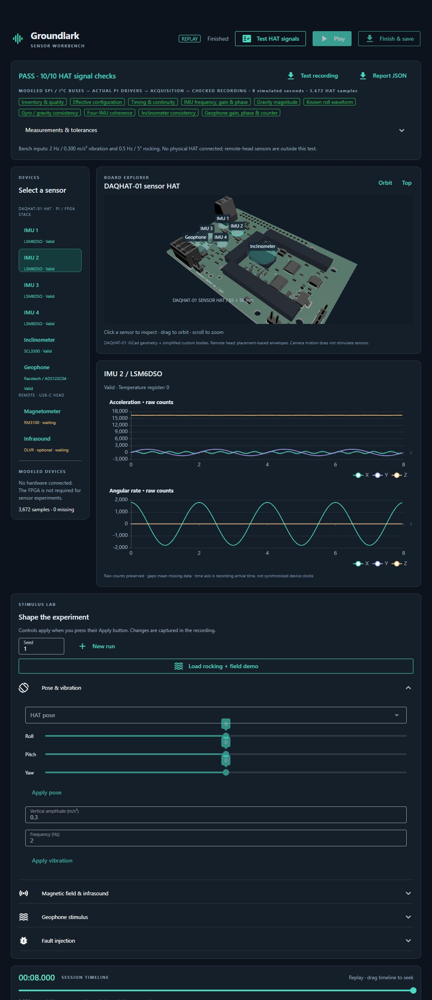

# Workbench implementation and validation

Start with the [beginner guide](sensor-workbench.md) for installation and a first experiment.

## Data and timing

### HAT acquisition signal test

Press **Test HAT signals** in the top bar. Save your current experiment first:
the button replaces the displayed session with the test recording. This runs
eight seconds of simulated time faster than real time and loads the resulting
capture into replay. The pass/fail panel belongs to that capture and is cleared
when you start a different run or import another recording. Download the exact
recording and its JSON report using the panel buttons; the report includes the
recording's SHA-256. Seek backward and press Play to inspect the checked signals.

Unlike ordinary simulation, this test feeds the models through register/packet
buses into the production `LSM6DSO` and `ADS122C04` driver classes,
then through the acquisition, session validation and recording code. It checks
3,264 samples from the four HAT sensors. Remote-head sensors are outside this test.

The fixed excitation is a 2 Hz, 0.300 m/s² X-axis acceleration sine wave, 0.5 Hz,
5° roll, and a geophone input of 100 µm/s at 10 Hz. The independent recording
analyzer checks inventory/quality, effective configuration, sample timing and
continuity, tone frequency/gain/phase, gravity magnitude, prescribed roll,
integrated gyro versus gravity-derived roll, agreement across three IMUs,
and geophone gain/phase and conversion-counter rollover.
Measurements and explicit tolerances are expandable in the UI. These are
**ideal-model regression limits**, not manufacturing acceptance specifications.
Geophone excitation is commanded independently of HAT motion; the test does
not establish a shared mechanical mounting model.



The portable software profile also saves `results/sw/build/hat-signals.ssrec`
and `hat-signals.json` in its retained run. After starting the UI once, the
same check can be run from the Windows UI environment:

```powershell
$env:GROUNDLARK_DESCRIPTOR = "$PWD/sw/build/ui-schema.binpb"
./.local/ui-venv/Scripts/python.exe sw/tools/check_hat_signals.py --output .local/hat-check.ssrec
```

Choose a new output filename for each manual run; existing recordings are never
overwritten. The signal regression tests include negative controls which alter
otherwise valid, CRC-correct records or excitation. Wrong frequency, gain,
polarity, motion, stuck channels, gyro scale, geophone polarity, timestamps
and missing measurements must fail. Existing independent bus-vector tests remain
the guard for wire constants/CRC logic shared by a driver and a modeled bus.
This does not exercise Linux ioctls, physical SPI/I²C timing, or real HAT noise.

### Display semantics

All six sensors use the existing `Acquisition`, `Simulated`, `Scenario`,
`Sessions` and CRC-protected recording code. The display does not generate a
second stream of decorative data. Stimulus changes are recorded before the
corresponding samples, and simulation steps are fixed at 1 ms. UI/wall-clock
delays slow the experiment; they do not change its sample values or create
invented timestamps. Camera movement never schedules stimulus changes.

Charts show native **raw counts**. Temperature registers are not silently converted to °C. Missing fields
are `null` chart gaps; valid zeros remain zeros. Saturation and fault labels are
visible. The geophone shows its conversion counter and signed ADC counts.
The pressure display preserves its raw status bits. This version does not plot
optional calibrated outputs or spectral estimates.

The time axis is recording **arrival time**, relative to the first record when
replaying. Pi and MCU acquisition timestamps remain intact in the recording;
the UI does not imply their clocks are synchronized. Replay supports recordings
up to 8 MiB and one hour in duration, including incomplete recordings with a
visible completion warning. Only 400 recent points per sensor and 20 recent
events are retained for display. The acquisition record itself is bounded at
8 MiB. Existing scenario limits (256 events / 8192 normalized bytes) apply to
interactive controls as well as imported scenarios.

The DAQHAT-01 3D asset comes from checked KiCad geometry, with simplified custom bodies
added in Python. The remote head is an approximate placement-based visualization
and the external geophone uses a nominal 25.4 mm diameter, 33 mm tall can with
illustrative terminals/leads. Selecting the can or HAT input highlights both
and selects the same geophone stream (sensor 9). The remote head
shows the optional pressure sensor. See [asset provenance](../sw/ui/assets/README.md).
These views and ideal sensor models do not establish mechanical fit, magnetic
noise performance, electrical timing or fabrication readiness.

## Develop and test

The page is in [main.py](../sw/ui/main.py), with appearance in
[style.css](../sw/ui/style.css). Research logic belongs in the independent
[workbench controller](../sw/pi/groundlark/workbench.py) or
[stimulus models](../sw/pi/groundlark/stimulus.py), not in browser callbacks.
NiceGUI supplies the browser engine; all authored UI behavior is Python.

```powershell
# Full sensor/contract regression suite, including workbench controller tests
./lab.ps1 test -Profile software
# Actual NiceGUI HTTP page construction and board asset delivery
./ui.ps1 -Check
# Launcher paths, error propagation and local environment boundaries
./.local/ui-venv/Scripts/python.exe -m unittest discover -s environment -p test_ui_launchers.py -v
```

On Linux/macOS, use `sh ./ui.sh --check` instead.
The optional UI environment has its own lock; dependency changes require
`uv lock --project sw/ui` and retesting. It does not rebuild the PCB or modify
atopile's dependency lock.

Controller tests exercise deterministic stepping, pause, controls, raw signed
values, missing-data gaps, no-fix behavior, bounded buffers, recording validation,
relative replay time, backward seeking, CLI scenario export, and run limits.
The HTTP smoke check does not test WebGL. Browser review must also cover board
picking, sensor switching, pause/resume, applied stimulus, downloads, uploads,
replay seeking and a narrow viewport before claiming the full UI works.

## Latest focused verification

On 2026-09-26, portable run `20260926T205030Z-a12c1c5d` passed all three
software-profile stages, including 187 software tests. The separate UI page,
asset and geophone scene checks passed. Browser review covered clicking the
external can, shared can/ADC selection, a 2 Hz tone, pause, remote-head switching
and a 680 px viewport without horizontal overflow. The README image is an
actual screenshot of that modeled experiment.
The browser's **Test HAT signals** action also passed all nine checks on 3,264
samples. Portable `lab unit` passed 17 checks with two Windows-only skips;
all four launcher checks passed separately on Windows.

Both setup scripts were exercised on Windows and Ubuntu/WSL. macOS uses the
same POSIX script but has not been tested here. Launcher regressions cover
paths with spaces, invoking from another directory, project-local environment
paths and failing dependency/check commands. Windows additionally checks that
the caller's environment is restored after failure. `lab unit` includes these
regressions on Linux; run them on Windows as above for its platform-specific case.

