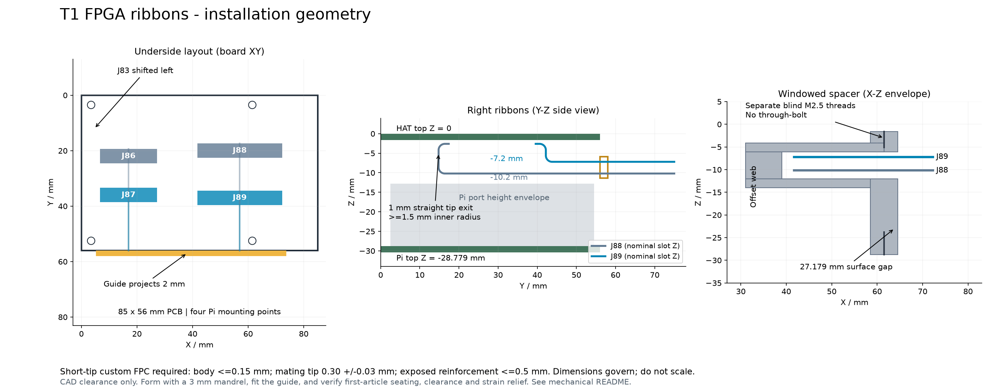

# Retired mechanical design

This guide and offset spacer belong to revision `64d4190`. DAQHAT-01 removes
the external connectors and uses four straight supports. These archived assets
are not part of the current assembly or fabrication package.

# DAQHAT-01 ribbon spacer and guide

This assembly replaces the **south-right straight Pi spacer** when fitting
J86-J89. It preserves all four Pi mounting points and the 85 x 56 mm PCB.
The guide projects 2 mm past the south board edge; the flexible tails continue
outward. It does not change the Pi/HAT or HAT/Trenz stack heights.

Files: `offset-spacer.step` is the machined structural part;
`ribbon-guide.step` and `.stl` are the insulating guide. The spacer STL is
for visualization/mock-up, not a substitution of printed plastic for aluminum.
STEP coordinates use the HAT top-left, top surface Z=0, +Y south, units mm.
The separately generated display STEP copies in `hw/models` have Y reversed
for KiCad. Bores in STEP are tap-drill sizes, not modeled screw threads.

## Manufacturing dimensions

- Spacer material: machined 6061-T6 aluminum, deburred. Insulate its upper arm
  with thin polyimide film; finished top envelope must remain Z <= -4.0 mm.
- Boss centers: X=61.5, Y=52.5; diameter 6.0 mm. Overall support height
  27.179 mm (HAT underside Z=-1.6 to Pi top Z=-28.779). Adjust only with
  measured shims to match fully seated Pi sockets; do not preload/bow PCBs.
- Top boss reaches Z=-6.1. Upper arm: X=31..61.5, Y=50.5..55.5,
  Z=-6.1..-4.1 (2 mm thick). Offset web: X=31..39, Y=50..56,
  Z=-12..-6.1. Lower arm: X=31..61.5, Y=50..55, Z=-14..-12.
- Top M2.5 x 0.45 blind thread: at least 2.5 mm full thread, 3.5 mm drill
  depth. Bottom M2.5 x 0.45: at least 4 mm full thread, 5 mm drill depth.
  **Separate short screws; never a through-bolt across the cable window.**
  Select screw lengths for 2.0..2.5 mm engagement at the top and 3..4 mm at
  the bottom, after PCB/washer thickness. Verify they cannot bottom out.
- Two M2 x 0.4 blind guide threads from the south web face Y=56: X=33 and
  X=37, Z=-8.7; 3 mm full thread, 4 mm tap drill depth. Guide mounting holes
  are 2.2 mm clearance; use M2 x 5 mm screws with <=3.8 mm diameter heads.
- Guide: insulating PA12 or machined POM. X=5.25..73.75, Y=56..58,
  Z=-11.4..-5.9. Four 0.9 mm high slots, centers X=17/57 and
  Z=-7.2/-10.2; widths 21.5/31.5 mm respectively. Entrance radii 0.15 mm
  are in the STEP. Smooth and inspect slots; no rough print ridges on flex.
- General machining tolerance +/-0.10 mm; guide slots +/-0.10 mm, clear of
  burrs. Verify final stack before tightening. CAD clearance includes 0.5 mm
  cable-placement allowance and 1 mm allowance above Pi port envelopes.

## Cable contract

Use **custom single-layer polyimide FPC tails**, nominal length 150 mm,
0.50 mm contact pitch, 20.5 mm (40 contacts) / 30.5 mm (60 contacts) width.
The flexible body including coverlay must be <=0.15 mm. No vias, splices,
stiffeners or copper planes in the bending regions. Use bend-to-install
construction, not a continuously moving harness.

The connector tips must match Amphenol F32Q's supplier drawing, including
0.30 +/-0.03 mm total mating thickness. The stiffener must end **at most
0.5 mm beyond the latched connector mouth**. Allow 1 mm of straight exit
before each 1.5 mm radius bend. Set reinforcement length from actual insertion
depth; do not assume a generic FFC's 5-10 mm reinforcement is compatible.
The far-end contact orientation and mapping must match its eventual receiver.
This is a mechanical procurement contract, not a released receiver harness
or a claim that an off-the-shelf cable has been qualified.

The 1.5 mm minimum inner radius is 10 times the maximum flex-body thickness.
The model uses 1.6 mm centreline radii, leaving at least 1.5 mm on the inside
of the specified 0.15 mm body. This exceeds
the single-layer 6x static guidance in [JLCPCB's flex capabilities](https://jlcpcb.com/capabilities/flex-pcb-capabilities)
and follows the conservative 10x approach discussed in [Minco's design guide](https://www.minco.com/wp-content/uploads/Minco-Flex-Circuits-Design-Guide-2019.pdf).
Obtain the cable maker's stackup/bend confirmation; those general rules do not
qualify a particular material stack or repeated flexing.

## Installation

1. Trim and inspect all underside through-hole ends: <=2 mm below the HAT,
   including solder. Check the guide and spacer for burrs and dimensions.
2. Pass all four tails through the guide before inserting their connector
   tips. J86/J88 use the lower slots; J87/J89 use the upper slots.
3. Form bends over a smooth 3 mm diameter mandrel while supporting the free
   cable, before final insertion. Maintain >=1.5 mm radius, the 1 mm straight
   exits and a vertical tangent between each pair of quarter-circle bends.
   Do not pull on the latch or crease the flex to achieve the final position.
4. Seat/latch tips with contact side away from the underside PCB, then check
   the unbent reinforced portion ends before the first bend. Fit the guide
   and windowed spacer, then lower the assembly onto the Pi riser.
5. Check at least 0.25 mm clearance to J83's tails, separation between ribbons,
   free travel through slots and >=1 mm space above the Pi ports. Add strain
   relief outside the stack; the guide is a locator, not a cable pull clamp.
6. Inspect under load, mate-cycle and temperature during first-article work.
   The CAD checks are not a measurement of stiffness, pull strength or fatigue.

Generate mechanical CAD with Python 3.12 + `cadquery-ocp==8.0.1.0.0`:
`python hw/tools/ribbon_mechanics.py`. This optional tool does not alter the
PCB and is kept out of the portable electronics test environment. Geometry
and regressions run through the normal lab without that dependency.
